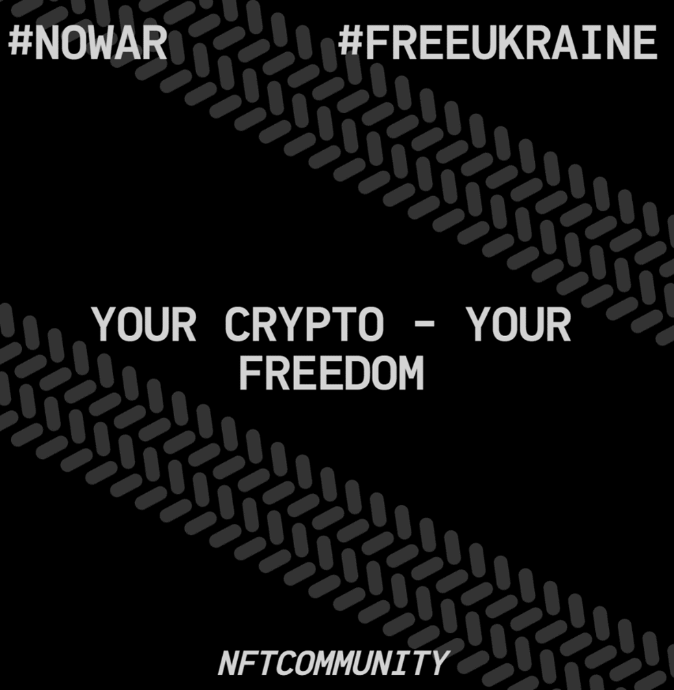

# General

[Invaded](https://invaded.art) is a dynamic fully on-chain NFT collection created by the people.  
Focus on engaging crypto communities to help Ukraine with

- **Donations**: the smart contract is hardcoded to send all donations to the official Ukraine ETH donation address: 0x165CD37b4C644C2921454429E7F9358d18A45e14.
- **Embracing the freedom of speech**: people can type what they think or feel about what is happening. The messages are converted to NFT tokens and will stay publicly available on decentralized environment forever.

Web3 Dapp is available at: [https://invaded.art](https://invaded.art)  
OpenSea collection link: [https://opensea.io/collection/invaded](https://opensea.io/collection/invaded)

# Smart contracts

The heart of the system is Ethereum smart contracts:

- [0x21fd8ad3f74e75dD9Cd0F3c276B13e604f27e7e7](https://etherscan.io/address/0x21fd8ad3f74e75dd9cd0f3c276b13e604f27e7e7): "Invaded" NFT token smart contract manages NFT collection and makes sure all funds are sent to the official Ukraine ETH donation address
- [0x51c71a576183c7E9195c6ad6F8F393f6a59EEF55](https://etherscan.io/address/0x51c71a576183c7e9195c6ad6f8f393f6a59eef55): "Invader" smart contract responsible for rendering NFTs. It is swappable so rendering can be changed in the future to reflect events (for example Ukraine Freedom!)

Both smart contracts are open and available for review on [etherscan.io](https://etherscan.io/)

# Features

- People can use [a-z] and '-' characters (72 characters maximum) to type their message
- One message is per wallet to avoid spam
- Can be configured to allow only unique messages
- NFT tokens are non-transferrable until community decides (when Ukraine gets free?)
- The rendering can be changed for all or selected tokens
- Tracks angle is random
- First token is reserved; it can be minted later. It is 1/1 token that can represent something as community decides. A good example is Clock token from AssangeDAO or Ukrainian flag from UkraineDAO.
- All tokens are dynamic and can reflect an NFT community token’s owner belongs to. ERC721 based communities are supported. The smart contract looks up owner’s balance to if it is more than 0 for the registered communities. Community info is displayed at the bottom. I added that to engage crypto communities to participate. For example:  
  

# Development Notes

All configurations and commands work for Node.js v17.0.1. Other versions are not validated.

## Web3

Dapp scripts are located under `front_invaded` folder. So, all Dapp related commands should be executed from this folder. The Dapp is created with react-scripts + ethers. All dependencies are specified in `front_invaded/package.json`, to install them all, just run (from `front_invaded` folder):

```
npm install
```

To run Dapp you will need Moralis server. You can get it for free by signing up [here](https://admin.moralis.io/login). After you get Moralis server, create from_invaded/.env file and specify there REACT_APP_API_KEY and REACT_APP_URL.

Dapp is currently pointed to Ethereum mainnet (see `front_invaded/contracts folder`). To run Dapp locally run the following:

```
npm start
```

## Hardhat

Before all hardhat commands make sure set the `NODE_OPTIONS` environment variable to "--openssl-legacy-provider" (necessary for Node.js v17.0.1). For example, to run local hardhat instance:

```
$Env:NODE_OPTIONS = "--openssl-legacy-provider"
npx hardhat node
```

Hardhat configurations are found in `hardhat.config.js` file. For Ethereum test/main net interactions, create `secrets.json` file:

```
{
  "etherscanApiKey": "******************",
  "rinkeby": {
    "url": "******************",
    "key": "******************"
  },
  "main": {
    "url": "******************",
    "key": "******************"
  }
}
```

To deploy contracts locally run

```
npx hardhat run scripts/deploy_local.js --network local_invaded
```

Note that deployment scripts will override contracts configurations in the `front_invaded/contracts` folder.
